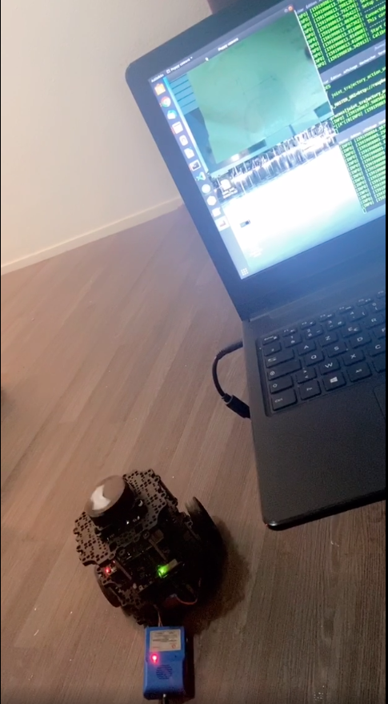

# robotics-centre-de-tri

Middleware Ros (Python, C++) - Vision (Python) - Deep Learning (Python), Hardware (arduino, openCl, RaspberryPi 3)

<h2>Projet de centre de tri</h2>

__Projet:__

    -Le but de ce projet d’intégration est de développer un système robotique de centre de tri
    s’appuyant sur une machine local et deux robots réels (Turtle Bot et Poppy) par téléopération,
    un réseau de neurones pour la reconaissance de texte et de proposer une simulatation virtuelle
    sous gazebo

    -Poppy prend des objets qu'on lui remets (pick)
    -Poppyreconnait des formes grace à sa caméra, détecte l'emplacement de tri associé à la forme
    -Poppy appelle le TurtleBot lui remet l'objet
    -TurtleBot le dépose a l'endroit indiqué (en évitant les obstacles) et attends de nouvelles instruction
    
    Thématique à couvrir :
    - Naviguation stack sous ROS
    - deep learning
    - teleopération

## 2. Logiciel utilisés

Gestion de projet: GitLab 

Scrum: framemo [Lien](https://framemo.org/ouscrm)

ROS

RVIZ

GAZEBO

VISION OPENCV Python et Keras
